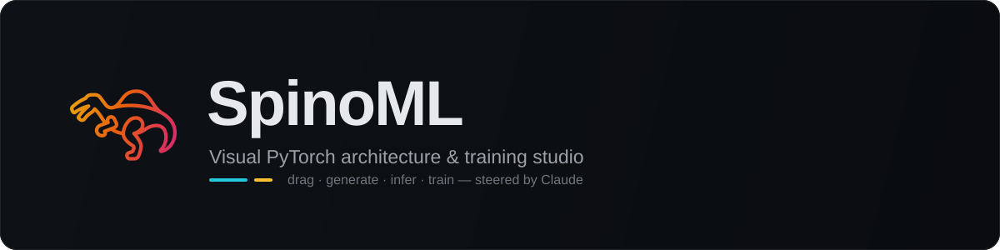
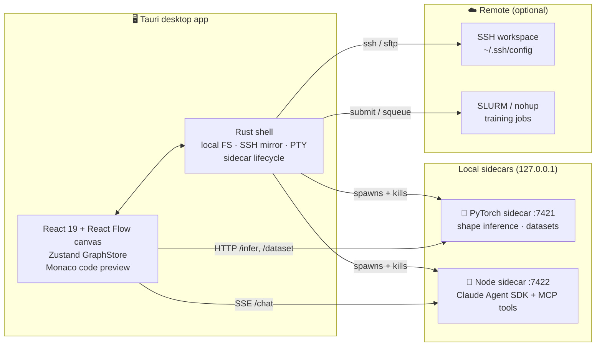

<div align="center">



<br/>

**_SpinoML_ — Super Perfect Intuitive and Organized Machine Learning.**

**Build, validate, generate and train PyTorch models on a visual canvas — with Claude as a co-pilot that edits the graph live.**

<br/>


</div>

---

## What is SpinoML?

SpinoML is a desktop studio for designing neural networks **visually** and taking them
all the way to a running training job — without leaving the canvas.

Drag layers onto a graph, wire them together, and SpinoML continuously:

- **infers the tensor shapes** through every layer and flags mismatches inline,
- **generates clean `nn.Module` PyTorch source** in real time,
- lets a connected **Claude assistant edit the graph** through tool calls, and
- compiles a separate **training graph** that you can launch locally, over SSH, or on a SLURM cluster.

It runs as a native [Tauri](https://tauri.app) app (Rust shell + system webview) with two
local sidecars: a **PyTorch** process for shape inference & dataset introspection, and a
**Node.js** process running the **Claude Agent SDK**.

<div align="center">
<sub>🧩 56 layer types · 12 categories &nbsp;·&nbsp; 🔬 live shape inference &nbsp;·&nbsp; 🐍 PyTorch codegen &nbsp;·&nbsp; 🤖 Claude co-pilot &nbsp;·&nbsp; 📊 6 dataset formats &nbsp;·&nbsp; 🚀 local / SSH / SLURM training</sub>
</div>

---

## ✨ Highlights

| | |
|---|---|
| 🧩 **Visual model builder** | Drag-and-drop canvas (React Flow) with 56 layer types across 12 categories — Conv, Linear, Attention, Recurrent, Graph/GNN, Norm, Pool, Merge, Reshape, and more. Multi-input / multi-output graphs with merge layers. |
| 🔬 **Live shape inference** | Every edit is pushed to a PyTorch sidecar that runs a sample tensor through the graph and writes the inferred shape back onto each node. Mismatches surface inline with one-click *FixHints*. |
| 🐍 **PyTorch code generation** | A pure, deterministic generator turns the graph into idiomatic `nn.Module` source, previewed live in a Monaco editor and exportable as a `.py` twin. |
| 🤖 **Claude co-pilot** | A chat panel backed by the Claude Agent SDK observes the graph through MCP tools and can add/remove/rewire layers and even build whole training setups on request. |
| 📊 **Dataset explorer** | Inspect tabular, image-folder, tensor, protein (PDB), molecule (SMILES) and HuggingFace datasets — with stats, previews, and a **smoke test** that feeds a real sample through your model. |
| 🏋️ **Training system** | A dedicated training-graph editor compiles to a runnable loop. Launch runs **locally**, **remotely over SSH** (`nohup`), or **on SLURM** — with live loss/metric charts, progress + ETA, multi-run compare and hyperparameter sweeps. |
| 🖥️ **Remote workspaces** | Open a workspace on a remote host over plain `ssh` (uses your `~/.ssh/config`, agent, ProxyJump — no secrets stored). Built-in terminal tab attaches to a local or remote shell. |

---

## 🏗️ Architecture



**Two execution modes** (browser dev vs. native Tauri) and **two filesystem backends**
(local disk vs. remote SSH) are abstracted behind a single dispatch layer, so the same UI
drives a folder on your laptop or a scratch directory on an HPC cluster.

---

## 🧱 Tech stack

| Layer | Technology |
|---|---|
| **Shell** | Tauri 2 (Rust + system webview) |
| **Frontend** | React 19 · TypeScript · Vite · React Flow · Zustand · Tailwind v4 · Monaco |
| **LLM bridge** | Node.js sidecar running `@anthropic-ai/claude-agent-sdk` (uses Claude Code OAuth — your Max subscription, not pay-per-use) |
| **Shape inference & datasets** | Python sidecar running PyTorch, HTTP on `127.0.0.1:7421` |
| **Terminal / remote** | `portable-pty` PTYs · system `ssh` transport (no stored secrets) |

---

## 🚀 Getting started

> Everything runs inside the `spinoml-dev` conda env (node 20, rust stable, python 3.12).

```bash
conda activate spinoml-dev
npm install

# Native app — the Rust shell auto-spawns both sidecars and kills them on close:
npm run tauri dev

# Or browser-only dev (no Rust; start the sidecars manually in extra terminals):
npm run dev                # http://localhost:5173
npm run sidecar:torch      # shape inference  → 127.0.0.1:7421
npm run sidecar:llm        # Claude bridge     → 127.0.0.1:7422
```

In Tauri mode the header badges read `shapes (auto)` / `LLM (auto)`. In browser mode you
start the sidecars yourself and the badges drop the `(auto)` suffix.

### Linux system dependencies (one-time)

```bash
sudo apt install -y \
  libwebkit2gtk-4.1-dev libjavascriptcoregtk-4.1-dev libsoup-3.0-dev \
  libgtk-3-dev librsvg2-dev libayatana-appindicator3-dev pkg-config
```

### Building a distributable

```bash
npm run tauri build      # writes a .deb to src-tauri/target/release/bundle/deb/
sudo dpkg -i src-tauri/target/release/bundle/deb/spinoml_*_amd64.deb
spinoml                  # launch from the menu or the terminal
```

The bundle (~80 MB) embeds both sidecars. On the target machine the app expects
`python3` with `torch`, `node` (≥ 20), and the authenticated `claude` CLI on `PATH`;
any missing piece just disables the matching sidecar — the rest of the UI keeps working.

---

## 🤖 Claude integration

SpinoML talks to Claude through the **Claude Agent SDK** running in the Node sidecar.
It uses Claude Code's local OAuth, so:

- install the Claude Code CLI and run `claude setup-token` once (Max subscription), and
- **no API key is needed** — the sidecar inherits that authentication.

The assistant sees the live graph via in-process MCP tools and can mutate it (add layers,
rewire edges, fix shapes, scaffold training graphs) — every action is mirrored back into
the canvas through the same store the UI writes to.

---

## 📊 Datasets

Drop files into `<workspace>/datasets/` and they appear in the **Datasets** tab:

| Kind | Extensions | What you get |
|---|---|---|
| Tabular | `.csv` `.tsv` `.parquet` | head, dtypes, per-column stats, correlations |
| ImageFolder | folder w/ class subdirs | class counts, thumbnails, sizes |
| Tensor | `.pt` `.pth` `.npy` `.npz` | shape, dtype, stats, histogram |
| Protein | `.pdb` | chains / residues / atoms (biopython) |
| Molecule | `.smi` `.smiles` | MW / atom-count distributions (rdkit) |
| HuggingFace | `*.hf` containing `hf:name` | dataset reference |

Heavy Python deps (`pandas`, `Pillow`, `rdkit`, `biopython`, `datasets`) are lazy-imported —
if one is missing the UI shows the exact `pip install` to fix it. Each detail view has a
**Smoke test** tab that runs one real sample through your current model end-to-end.

---

## ✅ Verification

```bash
npm run build              # tsc + vite — must be green
npm run verify:codegen     # generates graphs → writes .py → runs python on each
npm run verify:sidecar     # autostarts the torch sidecar, asserts shapes & errors
npm run verify:traingen    # validates training-graph code generation
( cd src-tauri && cargo check )   # after Rust changes
```

---

## 📦 Project layout

```
src/
  canvas/        React Flow canvas + Zustand GraphStore (single source of truth)
  layers/        registry.ts — the layer registry (56 types, 12 categories)
  codegen/       graph → PyTorch nn.Module source (pure, deterministic)
  inference/     HTTP client + debounced subscription to the torch sidecar
  chat/          Claude SSE client + action dispatch into the graph store
  inspector/     per-node parameter forms with shape-aware FixHints
  datasets/      explorer, detail views, smoke test (6 formats)
  training/      training-graph editor, runs, live charts, sweeps
  workspace/     file explorer + virtual-FS / Tauri-FS bridge
  connections/   SSH connections + the local↔remote backend dispatch layer
  terminal/      xterm.js bound to a Rust PTY (local or ssh -tt)
src-tauri/       Rust shell: local FS, ssh_* mirror, PTY, sidecar lifecycle
sidecar-torch/   PyTorch — shape inference + dataset handlers
sidecar-llm/     Node.js — Claude Agent SDK + MCP graph tools
scripts/         verify-codegen / verify-sidecar / verify-traingen harnesses
```

A deeper operational runbook lives in [`CLAUDE.md`](CLAUDE.md).

---

## 📄 License

**Source-available — Noncommercial, No-Derivatives.** SpinoML is free to **run and use
for noncommercial purposes** (personal, educational, academic), and the source is open to
read. You may **not** use it commercially, modify it, or redistribute it without the prior
**written** permission of the copyright holder. See [`LICENSE`](LICENSE) for the binding terms.

For commercial licensing, modification, or redistribution permission, contact
<christoph.manitz@uni-leipzig.de>.

© 2026 Christoph Manitz. All rights reserved.
